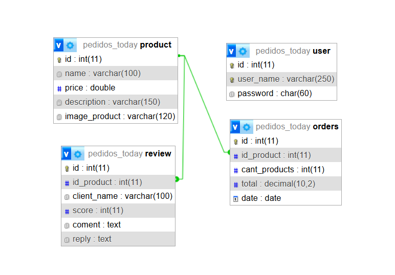
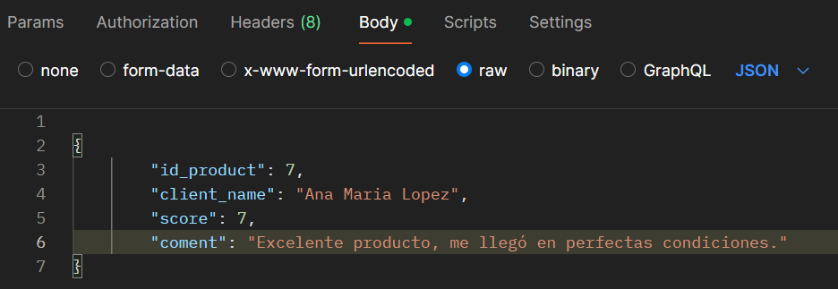

# **Participantes:**
-Maria Jose Giannaccini
-Juan Pablo Chiclana Urraco
  

# Descripcion:
Elegimos realizar una pagina de pedidos en un local de comidas rapidas. Va a constar inicialmente de dos tablas: una llamada product, la cual contiene un id de tipo primary, auto incremental; un name, de tipo varchar; un price y una description del producto.
Y una segunda tabla llamada orders, que se relaciona con la tabla producto a traves de su clave foranea id_product. Tambien cuenta con su id de tipo primary auto incremental; una cant_products; un total, que va a definir el total a pagar y una date, de tipo date. 

# Pautas para el despliegue de la web:
- Tener instalado xampp y encendido Apache y MySQL.
- Clonar el repositorio en la carpeta xampp/htdocs.
- La base de datos completa se crea automaticamente por la implementacion del auto Deploy, o se puede importar la base de datos completa desde phpMyAdmin, el archivo llamado db/pedidos_today.sql 
- Para poder realizar las modificaciones en las tablas se debe iniciar sesion, para ello el usuario registrado es:
usuario: webadmin
contraseña: admin
# Pautas para el uso de la api: 
Para hacer uso de la api debe utilizarse la aplicacion POSTMAN, la cual puede descargarse de esta direccion: https://www.postman.com/downloads/ (debe descargarse al equipo si va a utilizarse en local, es decir desde la propia maquina),
o puede descargarse una extension en visual studio llamada Thunder Client y usarse desde ahi mismo.
Para ingresar informacion para agregar o modificar con POST o PUT puede hacerse agregando los datos a ingresar desde el apartado: body- raw y con el formato JSON, pasando la informaion como un objeto:  ej:

  
# A continuacion quedan cargados los endpoint para las diferentes tablas
**Nota:** 
>Tabla reviews

Metodo GET: /trabajo-web2-Api-Chiclana-Giannaccini/api/reviews 
Se puede implementar el orden mediante las siguentes maneras: orderBy=score, orderBy=name, orderBy=id_product, por defecto ordena por id.
Se puede eleguir el orden: order=desc ó order=asc, por defecto ordena de forma asc.
Filtros:   
        - name = filtra por nombre;  
        - score = filtra por puntaje;  
        - coment = filtra por palabra en las reseñas;  
        - reply = filtra por palabra en la las respuestas;
Metodo GET: /trabajo-web2-Api-Chiclana-Giannaccini/api/reviews/:id  
Metodo DELETE: /trabajo-web2-Api-Chiclana-Giannaccini/api/reviews/:id  
Metodo PUT: /trabajo-web2-Api-Chiclana-Giannaccini/api/reviews/:id  
  
Los campos que se pueden modificar son:  
    {  
        "id_product": ...,       
        "client_name": ...,  
        "score": ..,  
        "coment": ...,  
        "reply" : ...  
    }  
Metodo PUT: /trabajo-web2-Api-Chiclana-Giannaccini/api/reviews/:id/reply  
Solo modifica el campo reply   
    {  
        "reply":...  
    }  
Metodo POST: /trabajo-web2-Api-Chiclana-Giannaccini/api/reviews   
Se pueden crear los campos  
    {  
        "id_product": ...,  
        "client_name": ...,  
        "score": ..,  
        "coment": ...,  
    }  
  
**Nota:**   
>Tabla orders  
  
Metodo GET: /trabajo-web2-Api-Chiclana-Giannaccini/api/orders  
Se puede implementar el orden mediante las siguentes maneras: orderBy=date, orderBy=total,  orderBy=cant_products, orderBy=id=product, por defecto ordena por id.  
  
Se puede eleguir el orden: order=desc ó order=asc, por defecto ordena de forma asc.  
Se puede filtrar de las siguientes maneras:   
- id_product=(id del producto)  
- total = (total =)  
- cant_products=(cantidad =)  
- date = (fecha = "yyyy-mm-dd")  
- total_greater = (total >)  
- total_minor =(total <)  
   
Metodo GET: /trabajo-web2-Api-Chiclana-Giannaccini/api/orders/:id  
Metodo DELETE: /trabajo-web2-Api-Chiclana-Giannaccini/api/orders/:id  
Metodo PUT: /trabajo-web2-Api-Chiclana-Giannaccini/api/orders/:id  
Metodo POST /trabajo-web2-Api-Chiclana-Giannaccini/api/orders  
  
Los campos que se pueden modificar o agregar son:  
    {  
        "id_product": ..,  
        "cant_products": ..,  
        "date": "yyyy-mm-dd"  
    }  
  
**Nota:**   
>Tabla products    
    
Metodo GET: /trabajo-web2-Api-Chiclana-Giannaccini/api/products  
Se puede implementar el orden mediante las siguentes maneras: orderBy=name, orderBy=price, orderBy=id, por defecto ordena por id.  
  
Se puede elegir el orden: order=desc ó order=asc, por defecto ordena de forma asc.    
Se puede filtrar de las siguientes maneras:   
- name = (name =)   =>  aqui se tiene en cuenta que la palabra este contenida en el nombre  
- price= (price =)  
- description = (description = ) => aqui se tiene en cuenta que la palabra este contenida en la descripcion  
- img = (img = )  => aqui se tiene en cuenta que la palabra este contenida en la url de la imagen, tambien busca por null  
  
Metodo GET: /trabajo-web2-Api-Chiclana-Giannaccini/api/products/:id  
Metodo DELETE: /trabajo-web2-Api-Chiclana-Giannaccini/api/products/:id  
Metodo POST: /trabajo-web2-Api-Chiclana-Giannaccini/api/products  
Metodo PUT: /trabajo-web2-Api-Chiclana-Giannaccini/api/products/:id  
  
Los campos que se pueden modificar o agregar son: 
 {  
        "name": "...",  
        "price": ..,  
        "description": "..",  
        "image_product": ".."   (este campo puede no estar presente. Si no esta se setea como null)  
}  
  
**Nota:**   
>Paginación  
  
En cualquier tabla de la pagina se puede realizar paginacion (Al momento de mostrar todos), para esto se deben utilizar los parametros:
show= ..&page=..  
  
**Nota:**   
>Autenticacion  
   
Para realizar algunas de las acciones en las diferentes tablas, hay que estar autorizado, para ello se debe autenticar ingresando los siguientes datos:  
metodo GET: /trabajo-web2-Api-Chiclana-Giannaccini/api/user/token  
user_name: webadmin   
Password: admin  
   
Las acciones que van a requerir autorizacion son:  
- Products: DELETE, PUT, POST  
- Orders: DELETE, PUT, POST  
- Reviews: PUT, DELETE  

